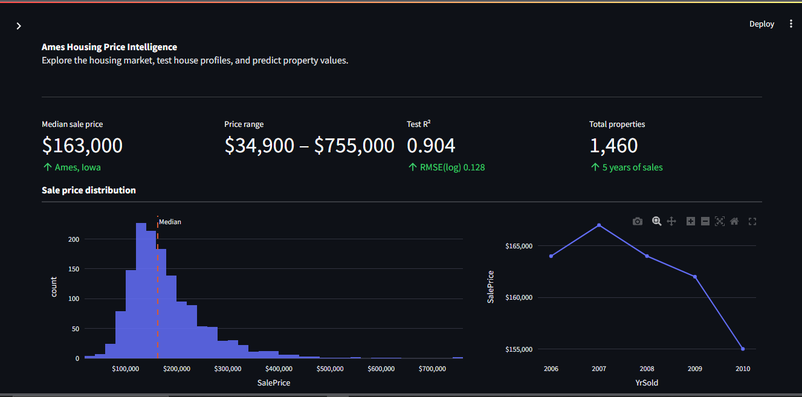
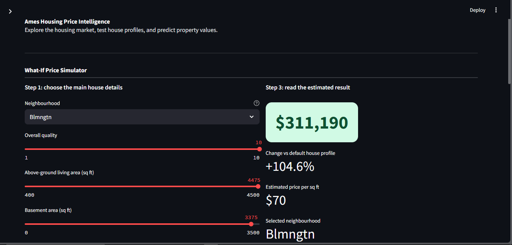
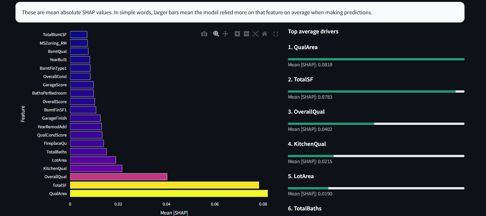

# Ames House Price Prediction App

An end-to-end machine learning project that predicts residential house prices using structured housing data from the Ames Housing dataset.  
This project was built to demonstrate a complete tabular ML workflow: data cleaning, feature engineering, model comparison, evaluation, interpretability, and deployment through an interactive app.

## Project Goal

The purpose of this project is:

- explore and understand the data
- clean missing values and inconsistencies
- create domain-informed features
- compare multiple regression models
- evaluate generalization carefully
- interpret model behavior
- deploy the final workflow in an app

## Dataset

This project uses the Ames Housing dataset, a widely used benchmark dataset for house price prediction.

It includes information about residential properties such as:

- neighborhood
- lot size
- overall quality
- basement area
- living area
- garage details
- number of rooms and bathrooms
- year built and remodeling year

Since this is a benchmark dataset from a Kaggle competition context, the project should be viewed as a demonstration of end-to-end ML engineering skills rather than a real commercial pricing system.

## Project Structure

```bash
.
├── notebook_01.ipynb
├── notebook_02.ipynb
├── notebook_03.ipynb
├── ames_pipeline.py
├── app.py
├── model.pkl
├── model_metadata.json
├── defaults.json
├── ui_feature_plan.json
├── train.csv
└── requirements.txt
```

## Workflow

### 1. Exploratory Data Analysis
In the first notebook, I explored the structure of the dataset and checked:

- missing values
- variable types
- skewed numerical features
- target distribution
- outliers and unusual patterns
- feature relationships with house price

The goal of this stage was to understand which variables were likely to be useful and where cleaning decisions would matter most.

### 2. Data Cleaning and Feature Preparation
In the second notebook, I focused on preparing the data for modeling. This included:

- distinguishing structural missing values from true missing values
- fixing or removing problematic values
- handling skewed distributions
- making feature-level cleaning decisions
- organizing inputs for the pipeline

This stage was important for making the later modeling process more reliable and consistent.

### 3. Feature Engineering
A custom feature engineering pipeline was used to create more meaningful predictors from the raw housing columns.

Examples include:

- HouseAge
- RemodAge
- TotalSF
- QualArea
- OverallScore
- QualCondScore
- GarageScore
- BathsPerBedroom

These features were designed using domain intuition so the model could learn stronger patterns from the available data.

### 4. Modeling
I compared several regression models, including:

- Dummy Regressor
- Linear Regression
- Random Forest
- Gradient Boosting
- XGBoost

Model selection was based on performance, generalization, and overall behavior rather than training score alone.

### 5. Evaluation

The project uses:

- train/test split
- cross-validation
- multiple error metrics
- residual analysis
- predicted vs actual analysis

This helped me judge whether the model was genuinely learning useful patterns or simply fitting the training data too closely.

### 6. Interpretability

To better understand model behavior, I used feature importance analysis based on mean absolute SHAP values.

This helped identify which transformed features were most influential in prediction and made the final model easier to explain.

### 7. Deployment
The final pipeline was deployed through a Streamlit app where a user can:

- input house details
- generate a price estimate
- explore how prices vary by neighborhood
- view feature importance and model explanations in simple language

## Final Model Summary

The final deployed model is an XGBoost regressor wrapped inside a full preprocessing and feature engineering pipeline.

### Final performance
- **Cross-validation R²:** ~0.912
- **Test R²:** ~0.900
- **Train R²:** higher than test, indicating some mild overfitting

The final model showed strong predictive performance on holdout data, but training performance remained higher than test performance, which is common with flexible boosting models. For that reason, model quality was judged mainly by cross-validation and holdout behavior rather than training fit.

## Key Insight

One of the most interesting findings in this project was that Linear Regression performed very similarly to XGBoost after feature engineering.

This suggests that strong feature engineering captured much of the signal in the data, and that model complexity alone was not the main driver of performance.


## Why Neighborhood Is Included in the App

Neighborhood was included in the app because it is a practical and intuitive real-estate input, even if it was not among the very top global SHAP features in the final model.

Users naturally think in terms of location when estimating house prices, so including Neighborhood improves the usability and realism of the app.

## App Features

The Streamlit app includes:

- user-friendly house attribute input
- final prediction output
- neighborhood comparison section
- feature importance section
- simple explanations for non-technical users

The app was designed to showcase not only model prediction, but also the ability to translate an ML workflow into a usable interface.

## Limitations

This project has some important limitations:

- the model still shows mild overfitting
- some engineered features overlap with their raw parent features, which may increase feature redundancy
- the final system is a demonstration project, not a real market-ready valuation engine

## Future Improvements

If this project were extended with more time, domain support, and collaboration, the next improvements would include:

- richer real-world housing data
- stronger validation design
- deeper feature selection and redundancy reduction
- more robust deployment setup
- better monitoring and feedback loops
- closer collaboration with domain experts and other ML engineers/data scientists

## Tech Stack

- Python
- pandas
- numpy
- matplotlib
- scikit-learn
- XGBoost
- SHAP
- Streamlit

## What This Project Demonstrates

This project was built to demonstrate my ability to:

- work end-to-end on a tabular ML problem
- make data cleaning decisions thoughtfully
- engineer domain-based features
- compare simple and complex models
- evaluate generalization honestly
- explain model behavior
- package the workflow into a usable app

## How to Run

### 1. Clone the repository
```bash
git clone <your-repo-link>
cd <your-repo-folder>
```

### 2. Install dependencies
```bash
pip install -r requirements.txt
```

### 3. Run the app
```bash
streamlit run app.py
```

## Screenshots



Add screenshots here for:
- app home page
- prediction page
- neighborhood comparison page
- feature importance page

## Author

**Rana Roy**  
If you found this project interesting, feel free to connect with me or explore my other work.
